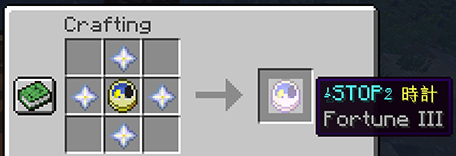
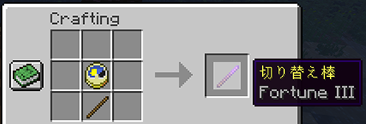

# spigot-jikanteishi

時間停止ができる Spigot プラグイン

## ダウンロード

[Releases](https://github.com/amotarao/spigot-jikanteishi/releases) を参照

## アイテム

### ストップウォッチ

何もない場所に対して、左または右クリックで発動

### 切り替え棒

プレイヤーに対して、右クリックで発動

